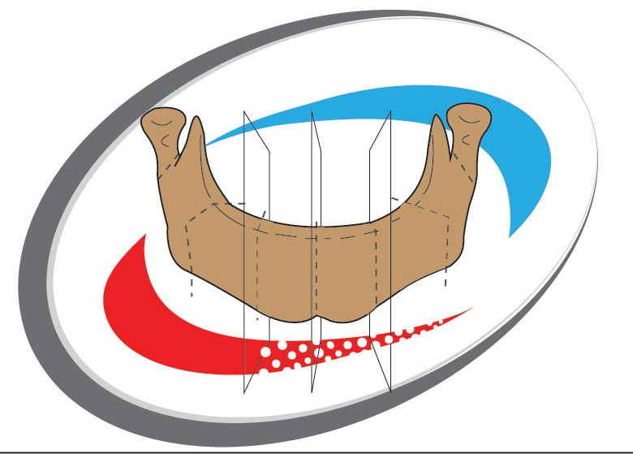
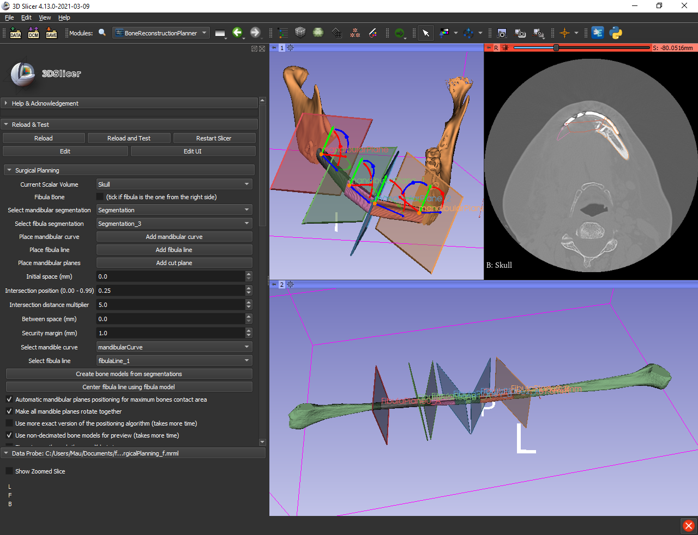
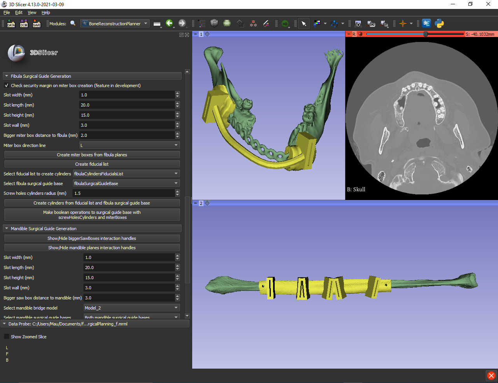

# Bone Reconstruction Planner

A 3D Slicer extension for virtual surgical planning of mandibular reconstruction with vascularized fibula free flap and generation of patient-specific surgical guides. 

# Introduction

Patient-specific guides dramatically improve the success rate and efficiency. 3D printing is revolutionizing reconstructive surgery by making it possible to construct patient-specific guides that are anatomically customized for each patient's need. Unfortunately, this technology is out of reach of most surgeons across the world due to the complexity and costs of existing solutions. The added cost of this technology, per case, is estimated to be around USD 3000 to USD 5000. Our ambition is to disrupt this market by providing an all-in-one cost-efficient and easy-to-use, open-source, and customizable software solution based on 3D Slicer, a free and open-source software package for image analysis and scientific visualization. The successful creation of this technology will enable the development of “patient and site-specific surgical guides”, manufactured through a combination of 3D planning and CAD/CAM. This solution will have the capacity to meet the complex needs of craniofacial reconstruction in a controlled manner. The outcome of the project will be an open-source solution that can make a 3D digital surgical plan that is transferred to the operating room via 3D-printed, patient-specific models, guides, and plates.

# Screenshots

- Virtual Surgery Planning:

- Patient-specific Surgical Guides:

# Video

 
# Documentation

- [High-level design overview](https://github.com/lassoan/SlicerBoneReconstructionPlanner/raw/main/Docs/Design.pptx)

# Use Cases
[First clinical use](https://github.com/lassoan/SlicerBoneReconstructionPlanner/discussions/40)

# Important information
- Mandible/Fibula Segmentation are inputs of this module. The segment at position zero (first segment of the segmentation) should be the mandible/fibula bone segment because it is used to make the 3D bone model used in BoneReconstructionPlanner.
- Mandible/Fibula segments shouldn't have holes inside because they confuse the positioning algorithm of the sawBoxes/miterBoxes. To eliminate holes from a segment use WrapSolidify effect in the segment editor.
- BoneReconstructionPlanner module is made to do virtual surgical planning and design of patient-specific surgical guides for mandibular reconstruction.
