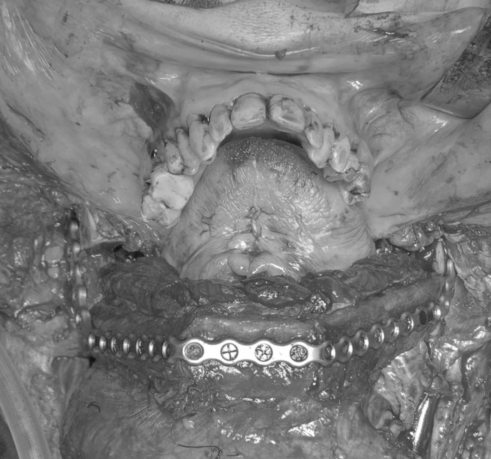

<!--


-->
<table style="border:hidden">
<tr>
<td></td>
<td></td>
</tr>
</table>

# BoneReconstructionPlanner

[](https://opensource.org/licenses/BSD-3-Clause)

A [3D Slicer](https://www.slicer.org/) extension for virtual surgical planning of mandibular reconstruction with vascularized fibula free flap and generation of patient-specific surgical guides. 


<table>
<tr>
<td align ="center">Virtual Surgery Planning</td>
<td align ="center">Patient-specific Surgical Guides</td>
</tr>
<tr>
<td></td>
<td></td>
</tr>
<tr>
<td align ="center">Custom Fibula Guide Use</br><a href="BoneReconstructionPlanner/Resources/Pictures/photo3DPrintedFibulaGuideUse.png"></br>SEE ORIGINAL PHOTO</a></td>
<td align ="center">Neo Mandible</br><a href="BoneReconstructionPlanner/Resources/Pictures/photoNeoMandible.png"></br>SEE ORIGINAL PHOTO</a></td>
</tr>
<tr>
<td align ="center" colspan="2">Pre Surgery Photo (left) and Post Surgery Photo (right) [*]</br></td>
</tr>
<tr>
<td align ="center">Pre Surgery Orthopantomogram [*]</br></td>
<td align ="center">Post Surgery Orthopantomogram [*]</br></td>
</tr>
<td align ="right" colspan="2">[*]: marked pictures belong to the same surgery and patient</td>
</tr>
</table>

# Developer statement

As an open-source developer committed to quality, I am dedicated to ensuring that our "medical" software meets the highest standards, with the goal of achieving ISO 13485 compliance in the future. If you encounter any bugs or issues, please [report them](https://github.com/SlicerIGT/SlicerBoneReconstructionPlanner/issues/new), and I will work diligently to address and resolve them promptly. (This software is not FDA approved)

# Citations

If you use BoneReconstructionPlanner please cite our paper:
https://www.sciencedirect.com/science/article/pii/S2666964123000103

```bash
@article{MAISI2023100109,
   title = {In-house virtual surgical planning for mandibular reconstruction with fibula free flap: Case series and literature review},
   author = {Steve Maisi and Mauro Dominguez and Peta Charmaine Gilong and Chung Tze Kiong and Syarfa Hajam and Ahmad Fadhli Ahmad Badruddin and Han Fong Siew and Saravanan Gopalan and Kok Tuck Choon},
   journal = {Annals of 3D Printed Medicine},
   volume = {10},
   pages = {100109},
   year = {2023},
   issn = {2666-9641},
   doi = {https://doi.org/10.1016/j.stlm.2023.100109},
   url = {https://www.sciencedirect.com/science/article/pii/S2666964123000103},
   keywords = {Virtual surgical planning, In-house VSP, Fibula free flap, Mandibular reconstruction},
}
```

# Table of Contents
- [Overview](#bonereconstructionplanner)
- [Developer statement](#developer-statement)
- [Citations](#citations)
- [Introduction to BoneReconstructionPlanner](#introduction-to-bonereconstructionplanner)
  - [Benefits of using personalized surgical guides](#benefits-of-using-personalized-surgical-guides)
  - [Cons of using personalized surgical guides](#cons-of-using-personalized-surgical-guides)
  - [User Considerations](#user-considerations)
- [Interactive VSP Demo](#interactive-vsp-demo)
- [Teaser and Tutorial Videos](#teaser-and-tutorial-videos)
- [Documentation](#documentation)
- [Reported Use Cases](#reported-use-cases)
- [Sample Data](#sample-data)
- [Instructions](#instructions)
  - [Installing BoneReconstructionPlanner](#installing-bonereconstructionplanner)
  - [Saving the scene](#saving-the-scene)
  - [Segmentation (Preparation for Virtual Surgical Planning)](#segmentation-preparation-for-virtual-surgical-planning)
  - [Virtual Surgical Planning](#virtual-surgical-planning)
  - [Personalized Fibula Guide Generation](#personalized-fibula-guide-generation)
  - [Create the Fibula Guide Base](#create-the-fibula-guide-base)
  - [Finish the Fibula Surgical Guide](#finish-the-fibula-surgical-guide)
  - [Personalized Mandible Surgical Guide](#personalized-mandible-surgical-guide)
  - [Mandible Reconstruction Simulation](#mandible-reconstruction-simulation)
  - [Export the planning outputs](#export-the-planning-outputs)
  - [Settings](#settings)
- [User contact and feedback](#user-contact-and-feedback)
  - [Contact](#contact)
- [License](#license)

# Introduction to BoneReconstructionPlanner

From the engineering point of view this project attemps to be a What You See Is What You Get (WYSIWYG) editor. 

Historically, this project started as Mauro I. Dominguez (EIE, FCEIA, UNR) MScEng Final Project with PhD Andras Lasso (PerkLab, Queens) supervision and Dr Manjula Herath (Malmö University) clinical advice on 2021. After first semester of '21 the project is maintained and keeps growing from Mauro's ad-honorem work.

Its math is robust so you should be able to correctly modify the reconstruction digitally at submillimeter scales (i.e. at features-sizes your eyes will not be able to distinguish). 

Digital means ideal but real-world objects are not, and neither are our inputs (e.g. CT slice thickness, bone models triangle density, smoothing factor, fibula centerline, etc). In addition to that have in mind that other sources of errors (printer resolution, printing orientation, anatomic fit considerations, etc) will add up although most of the time they'll be negligible, that is assumed because complaints have not been [reported](#reported-use-cases).

As far as we know our BoneReconstructionPlanner custom surgical guides will be accurate and effective enough to be adequate tools. Although, you are invited to do a mock surgery to sawbones using BoneReconstructionPlanner designed instruments yourself and weight the results before attempting their use on a IRB-approved case.


## Benefits of using personalized surgical guides
- less total surgical time
- less ischemic time
- less length of hospital stay after surgery
- better osteotomies accuracy
- better neomandible contour, more aesthetic

## Cons of using personalized surgical guides
- VSP software license (free if using BoneReconstructionPlanner,
15k USD annual license if using commercial software)
- 3D printer, biocompatible material, sterilization (can be done
on an in-house 3D printing lab or outsourced)
- needs research-review-board or FDA approval
- half an hour preoperative plan (plenty net time is still saved)
- learning curve for new user or need of biomedical engineer or
qualified technician

## User Considerations
- There are some parameters like the distance between faces of the closing-wedge osteotomies of fibula that can be increased if desired.
- Deviations from the Virtual Surgical Plan could come from big slice thickness CTs, suboptimal segmentation to 3D model convertions, big extrusion layers while 3D printing the guides, not accounting for tool fitting (e.g. periosteum remainings over bone, boneSurface2guideSurface fitting, etc) and other reasons.

# Interactive VSP demo

<table>
<td align ="center">3D models of a finished Virtual Surgical Plan of a Mandibular Reconstruction using Fibula Pieces</br></br><a href="https://3dviewer.net/index.html#model=https://github.com/SlicerIGT/SlicerBoneReconstructionPlanner/blob/main/BoneReconstructionPlanner.gltf">Open on interactive viewer</a></td>
</tr>
</table>

# Teaser and Tutorial Videos

<table>
<tr>
<td align ="center">Teaser</td>
<td align ="center">Tutorial (will be soon redone)</td>
</tr>
<tr>
<td align ="center"></td>
<td align ="center"></td>
</tr>
<tr>
<td align ="center">https://www.youtube.com/watch?v=wsr_g_1E_pw</td>
<td align ="center">https://www.youtube.com/watch?v=g9Vql5h6uHM</td>
</tr>
</table>

# Documentation
- [White Paper (pdf)](https://raw.githubusercontent.com/SlicerIGT/SlicerBoneReconstructionPlanner/main/Docs/BoneReconstructionPlannerSlides.pdf)

# Reported Use Cases
See more than 40 plans of other users:
- [Around 25 informally documented uses (Stonia)](https://github.com/SlicerIGT/SlicerBoneReconstructionPlanner/discussions/40)
- [One of the use cases by Dr. Manjula Herath (Sri Lanka)](https://discourse.slicer.org/t/bone-reconstruction-planner/19289)
- [One of the use cases by Dr. Steve Maisi (Malaysia)](https://github.com/SlicerIGT/SlicerBoneReconstructionPlanner/discussions/58). Link to the [corresponding paper](https://www.sciencedirect.com/science/article/pii/S2666964123000103).

# Sample Data

- Example of minimum data needed for making [segmentations](#segmentation-preparation-for-virtual-surgical-planning) of bones (i.e. mandible CT and fibula CT with 1mm or less axial slice thinkness):
  - <a href="https://github.com/SlicerIGT/SlicerBoneReconstructionPlanner/releases/download/TestingData/CTFibula.nrrd" >Fibula Scalar Volume</a>
  - <a href="https://github.com/SlicerIGT/SlicerBoneReconstructionPlanner/releases/download/TestingData/CTMandible.nrrd" >Mandible Scalar Volume</a>

- Example of minimum data needed for a [VSP](#virtual-surgical-planning) (mandible CT, fibula CT, mandible segmentation and fibula segmentation):
  - <a href="https://github.com/SlicerIGT/SlicerBoneReconstructionPlanner/releases/download/TestingData/FibulaSegmentation.seg.nrrd" >Fibula Segmentation</a>
  - <a href="https://github.com/SlicerIGT/SlicerBoneReconstructionPlanner/releases/download/TestingData/MandibleSegmentation.seg.nrrd" >Mandible Segmentation</a>

- Finished VSP and guides design (using data similar to the provided above) that can already be loaded to Slicer and modified further:
  - <a href="https://github.com/SlicerIGT/SlicerBoneReconstructionPlanner/releases/download/TestingData/TestPlanBRP_5.6.2.mrb" >Example Virtual Surgical Plan with Patient-Specific Surgical Guides</a>

- Toy VSP using a rib because a user wondered if it could be possible:
  - <a href="https://github.com/SlicerIGT/SlicerBoneReconstructionPlanner/releases/download/TestingData/TheoreticalPlanBRP_rib.mrb" >Theoretical Virtual Surgical Plan with a rib (Toy-example)</a>

- <a href="https://github.com/SlicerIGT/SlicerBoneReconstructionPlanner/releases/download/TestingData/Unofficial_BRP_Videotutorial_5.6.2_Spanish.zip" >Unofficial Spanish videotutorial</a> (credits to @marf-slicer)

# Instructions
(last validated May 2nd, 2025)

## Installing BoneReconstructionPlanner

1. You need Slicer 5.8.1 Stable. You have 2 options to download it:
   - Use a download link provided by Kitware: [Windows](https://slicer-packages.kitware.com/api/v1/item/67c53d1129825655577d0b13/download), [Mac](https://slicer-packages.kitware.com/api/v1/item/67c52e9629825655577d0353/download), [Linux](https://slicer-packages.kitware.com/api/v1/item/67c51fc129825655577cfee9/download)
   - As time of the writing of this guide you are also able to go to: https://download.slicer.org/ and download the Stable release (i.e. 5.8.1) for your Operating System.
2. Install Slicer (if you need help, follow [this document section](https://slicer.readthedocs.io/en/latest/user_guide/getting_started.html#installing-3d-slicer)).
3. Open Slicer.
4. Press Ctrl+4 to open the [Extensions Manager](https://slicer.readthedocs.io/en/latest/user_guide/extensions_manager.html#extensions-manager). Or click the upper-right icon with the letter 'E'.
5. Go to 'Install Extensions' tab.
6. On the upper-right search box write "BoneReconstructionPlanner".
7. Click install and give okay to install other extensions if asked (wait till ALL dependencies are installed completely). Then click "Restart" on the bottom-right corner.

To have in mind: every once in a while, you can enter the Extensions Manager and [check for updates](https://slicer.readthedocs.io/en/latest/user_guide/extensions_manager.html#update-extensions-for-slicer-stable-releases) of this extension to get latest bug fixes and added features.


## Saving the scene
- [Save](https://slicer.readthedocs.io/en/latest/user_guide/data_loading_and_saving.html#save-data) frequently as the surgical plan can be reopened from where you left it if there is a crash (i.e. software malfunction). We suggest using the "Save scene as single file (.mrb file format)", then you can save your progress with different names "example_plan_v01.mrb", "example_plan_v02.mrb", etc


## Segmentation (Preparation for Virtual Surgical Planning)

Make a mandible segmentation and a fibula segmentation.

Example of a fibula segmentation:

0. CTs should have a recommended slice thickness of 0.65mm (or a maximum slice thickness of 1mm). [Load the study to Slicer](https://slicer.readthedocs.io/en/latest/user_guide/modules/dicom.html#basic-usage).
1. Go to the [segment editor](https://slicer.readthedocs.io/en/latest/user_guide/modules/segmenteditor.html#segment-editor). Create a new segmentation. Create a new segment, name it 'fibula'.
2. Use threshold effect to select only bone. The lower threshold value should not be too high to lose detail (and the higher threshold value should be maximum). Check if your selected threshold value is okay if you can avoid [salt-and-pepper noise](https://en.wikipedia.org/wiki/Salt-and-pepper_noise) being added to the segmentation result. Suggested value: 200.
3. Use [scissors effect](https://slicer.readthedocs.io/en/latest/user_guide/modules/segmenteditor.html#scissors) to keep only the fibula bone.
4. Use [Islands effect](https://slicer.readthedocs.io/en/latest/user_guide/modules/segmenteditor.html#islands), select 'keep selected island' and click over the fibula to keep it. Click "Show 3D".
5. If successful, continue. If not, check out the [segmentation tutorials](https://slicer.readthedocs.io/en/latest/user_guide/modules/segmenteditor.html#tutorials) and start over.
6. Go to Wrap Solidify effect, on Advanced button set the suggested configuration below (by @SteveMaisi) and click apply. (This is needed because it is recommended that bone segmentations have no holes inside so the assisted miterBox positioning algorithms work well).

7. Correct new inaccurate protrusions if needed.
8. The bone segment (fibula in this case) should be the first of the segment-list of the segmentation. In other words the bone segment should be in position zero of the list.


You'll have to do the same for the mandible in another segmentation node.

## Virtual Surgical Planning

1. Click the search icon on the left of the module selector and write 'BoneReconstructionPlanner'. Click "Switch to module".
2. If fibula is the one from the right leg tick "Right side leg" checkbox. This makes fibula coordinate system X axis be always medial independently of the which leg is used to harvest the fibula.
3. Select the mandibular segmentation and the fibula segmentation.
4. Click "Create bone models from segmentations".
5. If needed, double left-click inside the mandibular 3D view to maximize it. And to return to the multi-view layout, also do double left-click inside the view.
6. Click "Add mandibular curve" and create a curve along the mandible. This will help giving the cut planes their initial position. It's a bit important to make it quite similar to the ideal mandible curve the patient would have if he was healthy because the algorithm that does initial planes positioning depend on it.
7. Click "Add cut plane" and click where you want plane. Add as many planes as needed. There will be a bone piece between every two adjacent planes. So the number of mandible planes should be the desired number of bone pieces for the reconstruction plus one. The first and the last mandible planes will be the mandible resection cuts.
8. Click "Add fibula line". Draw a line over the fibula on the 3D view. First point distal, last point proximal. Try to draw the line over the diaphysis.
9. Click "Center fibula line using fibula model" to make the line be similar to the anatomical axis of the fibula.
10. Tick these options: "Automatic mandibular planes positioning for maximum bones contact area", "Make all mandible planes rotate together"
11. Click "Update fibula planes over fibula line; update fibula bone pieces and transform them to mandible" to make the reconstruction and create the fibula cut planes. If VSP visualization is not working correctly you can try a hard-update using the button with recycle arrows, this will not change the objects used to create the VSP only the outputs.
12. Move the mandible planes as desired to change the position/orientation of the cuts.
13. Click "Update fibula planes over fibula line; update fibula bone pieces and transform them to mandible" again. And repeat as many times as needed.
If you tick the button it will react on plane movements and update automatically.
14. You may change "Segmental Mandibulectomy" to "Hemimandibulectomy" if desired, then click update again to calculate the new plan.
15. "Show/Hide original mandible model" button may be useful.
16. Explore other parameters. For example: "Between space" will guarantee some space between each fibula plane that creates a closing-wedge.

## Personalized Fibula Guide Generation

0. Go to "Fibula Surgical Guide Creation" section of BoneReconstructionPlanner. If the VSP changes, please remind all steps in this section need to be carried over again, same goes for the [Mandible Surgical Guide](#personalized-mandible-surgical-guide).
1. If "Check security margin on miter box creation" is checked, each saw-cut (and the bone it eats) will be tested to not collide with others.
2. Press shift over some fibula piece on the corresponding 3D view. The model should be visible on the 2D slice with the corresponding color as an edge. [Create a line](https://slicer.readthedocs.io/en/5.6/user_guide/modules/markups.html#place-new-markups) over the 2D slice of the fibula that will set the direction of the miterBoxes (with this you select, for example, lateral approach or posterior approach). The line should me drawn from the centerline of the fibula to a point that is distal from the first one on the 2D slice of the fibula.

3. Choose the line you have just created in the "Miter box direction line" selector.
4. Select the parameters of the miter boxes: length, width, height, wall thickness and tolerance (this last option is inside the Settings widget and it applies also to sawBoxes of the mandible). The combination of tolerance and the slot width suggested by most experienced user (@mrtig) is summarized below (more info [here](/Docs/NOTES.md#tolerance-and-slot-width)):

```
  These equations:
  - sawBoxWidth = sawBladeWidth
  - If SLA is used:
  clearanceFitPrintingTolerance = 0.25mm
  else if FDM is used:
  clearanceFitPrintingTolerance = 0.4mm
```

5. Click "Create miter boxes from fibula planes". The yellow miterBoxes will appear, each one with a long box that will create the slit for the saw to go through.

## Create the Fibula Guide Base
6. Go to the segment editor, add a new segment and create a copy (using the copy-logical-operator) of the fibula segment, rename it to "fibGuideBase".
7. Use Hollow tool with "inside surface" option and some "shell thickness" between 3mm to 6mm. The number should be decision of the user. Usually more thickness makes the contact between the miterBoxes and the guideBase easier to achieve but sometimes the guideBase ends up too big, wasting material or being uncomfortable. You can solve this, using a smaller shell if you do "masked painting" in the areas that need filling.
[Here is explained how to do it](https://github.com/SlicerIGT/SlicerBoneReconstructionPlanner/discussions/40#discussioncomment-1607995)
8. Shape the guidebase using scissors effect. The guidebase should still be in contact with all miterBoxes after finishing this step.
9. Optionally, add a mark on the guidebase to recognize the caudality (i.e. part of the surgical guide that should be positioned nearer to the feet).
10. Go to the data module and leave only the "fibGuideBase" segment visible on its segmentation, right-click it and press "Export visible segments to models".

## Finish the Fibula Surgical Guide
11. On the "Fibula Surgical Guide Generation" layout of BRP, click on the button "Create fiducial list" and position around one point per segment were you want the screw-hole to be (the fibGuideBase model should be visible).
12. Select the fibula guide base model that you exported on the corresponding model selector. Be sure the correct pointList is selected on the corresponding point selector.
13. Click "Create cylinder from fiducial list and fibula surgical guide base". Some cylinders should appear over the fibula guide base.
14. Congratulations: You are ready to execute boolean operations to create the guide. Click on "Make boolean operations to surgical guide base with screwHolesCylinders and miterBoxes". The guide will be created, you can be sure by using the NodeControlBox that is above and hiding everything else by clicking each "eye icon" of the component objects. The name of the guide will end with the word "Prototype". If you execute this button again after you did some changes to the plan (e.g. changed miterBoxes position) a new prototype will be created. 
15. (Infrequently needed) If boolean operations fail or there is a software crash in the step above, then shift by 0.1mm the virtual plan (i.e. "Initial space"), recalculate the fibula planes, recreate the miterBoxes and execute the boolean operations again.

## Personalized Mandible Surgical Guide

The workflow doesn't differ much from fibula guide creation.
Except that:
- The sawBoxes are movable and you should only move them inside the cut plane, to correct automatic mispositioning. After that hide the "biggerSawBoxes interaction handles" so you have a comfortable experience on later steps.
- If you are doing a "Segmental Mandibulectomy", you need to segment two guide bases, one for each planar cut, and copy them together to the same segment. Then export them as a unique model as explained on the earlier section.
- Optionally, you could create a bridge between both mandible guidebases to achieve a rigid connection between them when the mandible surgical guide is finished. The bridge can be created with the module "MarkupsToModel".
- If you created the VSP with "Hemimandibulectomy" mode you just need one mandible guidebase and the bridge is not needed nor allowed.
- You need to put the correct models on the corresponding selectors on "Mandible Surgical Guide Generation" panel

## Mandible Reconstruction Simulation
This maybe useful for users that want to prebend plates with a 3D printed model.
1. Do a [Virtual Surgical Plan](#virtual-surgical-planning)
2. Optionally, you can add an inter-condylar beam (i.e. a tube model) to the reconstruction for more rigidity. You can create the tube easily from a markups line with points that connects both condyles using the "Markups To Model" module. Select the beam model on the selector that is next to the "Create 3D model of the reconstruction for 3D printing" button.
3. Click "Create 3D model of the reconstruction for 3D printing" button.


## Export the planning outputs
- You may want to [export](https://slicer.readthedocs.io/en/latest/user_guide/data_loading_and_saving.html#export-data) the 3D models you created of mandible and fibula custom surgical guides, and the neomandible. Remember to select the ".stl" export format (which is the format used for 3D printers).

## Settings

You can use the "Lights rendering" setting to make the 3D visualizations nicer. Try "MultiLamp and Shadows", if you don't like it, you can always go back to "Lamp" default setting.


# User contact and feedback

Fell free to open an [issue](https://github.com/SlicerIGT/SlicerBoneReconstructionPlanner/issues/new) (or [report here](https://discourse.slicer.org/t/how-to-design-3d-printed-surgical-guide-for-mandible-reconstruction/19754/11)) if you find the instructions or the videotutorial inaccurate, or if you need help finishing the workflow

## Contact
_bone (dot) reconstruction (dot) planner (at) gmail (dot) com_

# License
- <a href="https://github.com/SlicerIGT/SlicerBoneReconstructionPlanner/blob/main/LICENSE" >Read license</a>
